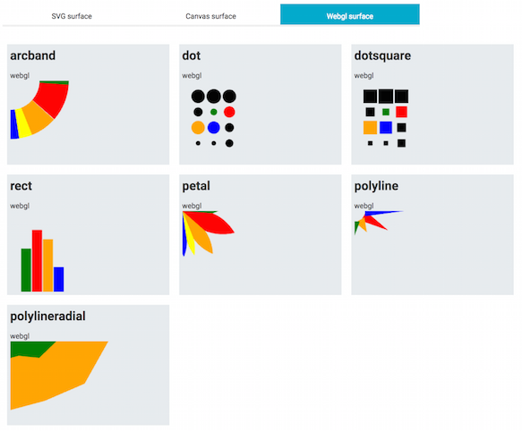

# multisurface-drawing

A quick experiment in drawing the same shapes across multiple surfaces (svg, canvas, webgl).

## Preview

## Develop

    npm run dev

## Build

    npm run bundle

## Usage

    npm run bundle
    open build/index.html

## Author

Marielle Pointon @widged

## Credits

* SVG to canvas functions adapted from [canvag](https://github.com/canvg/canvg)
* Webgl rendering via [PIXI.js](http://www.pixijs.com/)
